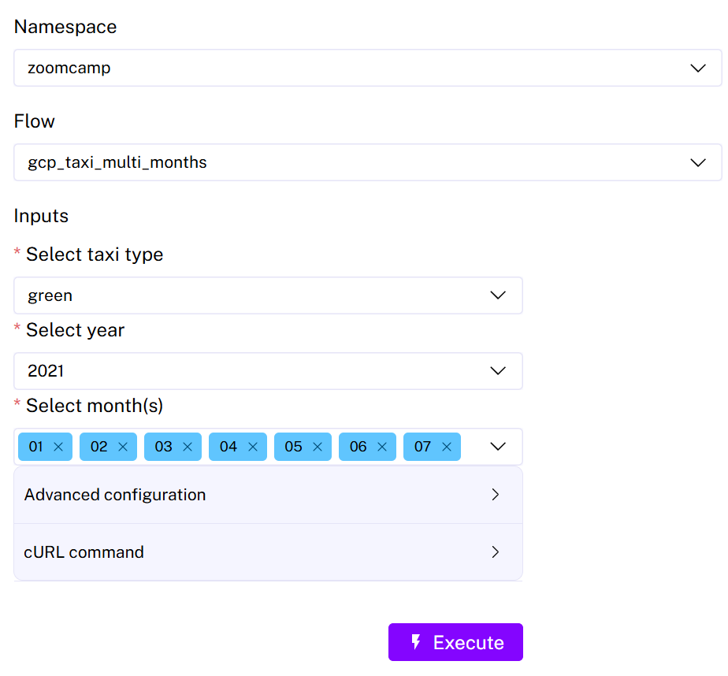

This file contains the workings and answers for `Module 2 - Workflow Orchestration`.
Questions can be found [here](https://github.com/DataTalksClub/data-engineering-zoomcamp/blob/main/cohorts/2025/02-workflow-orchestration/homework.md).

## Kestra setup
Using the flow [here](kestra/flows/gcp_taxi_multi_months.yaml) it is possible to execute an ingest of multiple months of taxi data at a time.


The flow uses a `ForEach` task, documentation [here](https://kestra.io/plugins/core/tasks/flow/io.kestra.plugin.core.flow.foreach). This allows the tasks to iterate through a list of values. The inputs have been set up so that a taxi type (green/yellow), year and multiple months can be selected.

```yaml
tasks:
  - id: for_each
    type: io.kestra.plugin.core.flow.ForEach
    values: "{{ inputs.months }}"
    tasks:
```

### Question 1: 
Within the execution for `Yellow` Taxi data for the year `2020` and month `12`: what is the uncompressed file size (i.e. the output file `yellow_tripdata_2020-12.csv` of the extract task)?

**Answer:**
128.3 MB

### Question 2:
What is the value of the variable file when the inputs taxi is set to `green`, year is set to `2020`, and month is set to `04` during execution?

**Answer:**
`green_tripdata_2020-04.csv`

### Question 3:
How many rows are there for the `Yellow` Taxi data for the year `2020`?

**Answer:**
`24,648,499`

### Question 4:
How many rows are there for the `Green` Taxi data for the year `2020`?

Query by pickup/dropoff times:
```sql
SELECT 
  COUNT(1)
FROM 
  `ny_taxi.green_tripdata`
WHERE 
  lpep_pickup_datetime >=  '2020-01-01 00:00:00' AND
  lpep_dropoff_datetime < '2021-01-01 00:00:00'
```
Which yields `1,734,027`, not in the multi choice options.

Query by file regex:
```sql
SELECT 
  COUNT(1)
FROM 
  `ny_taxi.green_tripdata`
WHERE
  REGEXP_CONTAINS(filename, r'^green_tripdata_2020')
```

**Answer:**
`1,734,051`

### Question 5:
How many rows are there for the `Yellow` Taxi data for `March 2021`?

Query by pickup/dropoff times:
```sql
SELECT 
  COUNT(1)
FROM 
  `ny_taxi.yellow_tripdata`
WHERE
  tpep_pickup_datetime >=  '2021-03-01 00:00:00' AND
  tpep_dropoff_datetime < '2021-04-01 00:00:00'
```
Which yields `1,924,852`, not in the multi choice options.

Query by file regex:
```sql
SELECT 
  COUNT(1)
FROM 
  `ny_taxi.yellow_tripdata`
WHERE
  filename like 'yellow_tripdata_2021-03.csv'
```

**Answer:**
`1,925,152`

### Question 6:
How would you configure the timezone to New York in a Schedule trigger?

**Answer:**
Add a timezone property set to America/New_York in the Schedule trigger configuration

```yaml
triggers:
  - id: daily
    type: io.kestra.plugin.core.trigger.Schedule
    cron: "@daily"
    timezone: America/New_York
```